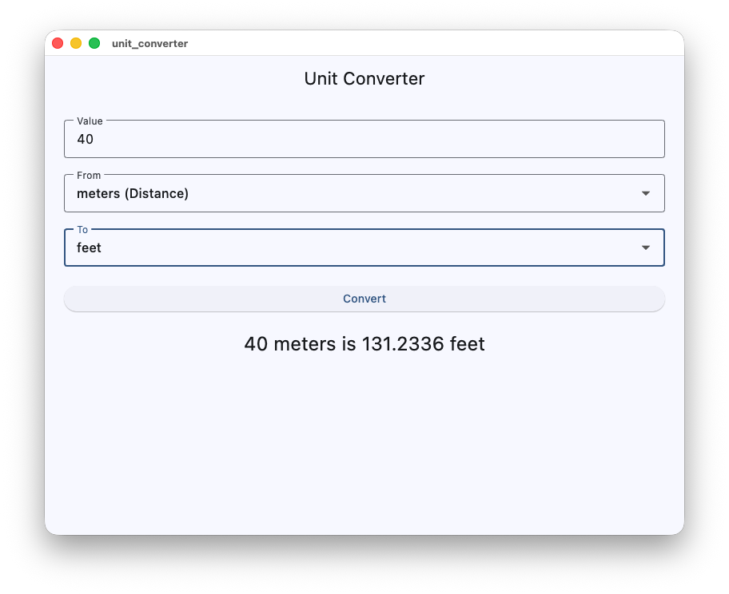

# Unit Converter

A multiplatform unit converter built with Flutter and Dart. Runs natively on iOS, Android, web, Linux, macOS, and Windows from a single codebase.

Built for MSCS 533 — Software Engineering and Multiplatform App Development at the University of the Cumberlands.



---

## Supported Conversions

| Category    | Units |
|-------------|-------|
| Distance    | meters, kilometers, centimeters, feet, yards, miles |
| Weight      | grams, kilograms, ounces, pounds |
| Volume      | milliliters, liters, fluid ounces, gallons |
| Temperature | Celsius, Fahrenheit, Kelvin |

16 units total. The **To** dropdown filters automatically to only show units in the same category as the selected **From** unit — invalid conversions are prevented at the UI level.

Temperature conversions use direct formulas. All other categories convert through a base unit (meters, grams, milliliters) using a stored multiplication factor.

---

## Architecture

```
lib/
├── main.dart                  # App entry point and root widget
├── models/
│   └── unit.dart              # Unit data model and all unit definitions
├── logic/
│   └── converter.dart         # Pure conversion logic — no UI dependencies
└── screens/
    └── converter_screen.dart  # StatefulWidget — input, dropdowns, result
```

The UI layer has no knowledge of conversion math and delegates entirely to the logic layer. The logic layer operates on plain Dart objects with no UI imports. Each component is independently testable.

---

## Running the App

**Requirements:** Flutter SDK 3.x+ (Dart SDK ^3.11.5)

```bash
# Install dependencies
flutter pub get

# Run on connected device or simulator
flutter run

# Target a specific platform
flutter run -d chrome     # web
flutter run -d macos      # macOS desktop
```

No third-party dependencies — only the Flutter SDK and `cupertino_icons` are required.

---

## Implementation Notes

- `Unit` stores a `toBaseFactor` for linear conversions. Temperature units set this to `0.0` as a placeholder — their logic is handled separately by `_convertTemperature()` in `converter.dart`.
- Conversion formula for linear units: `result = value × fromFactor ÷ toFactor`
- Results are formatted to 4 decimal places with trailing zeros trimmed.
